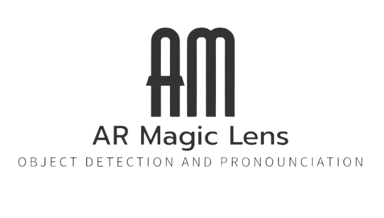

# AR Magic Lens 🔍✨
# AR Magic Lens 🔍✨

An innovative educational Flutter application that uses Augmented Reality to help children learn object names and pronunciation through interactive real-time object detection.



## 📖 About

AR Magic Lens is a Final Year Project (FYP) in Software Engineering at NUML, designed to make learning fun and interactive for children aged 3-8 years. The application combines cutting-edge AR technology with educational content to create an engaging learning experience that helps children identify objects in their environment and learn proper pronunciation.

## ✨ Key Features

### 🎯 Core Functionality
- **Real-time Object Detection**: Uses TensorFlow Lite models to identify objects through the device camera
- **Visual Recognition**: Displays bounding boxes around detected objects with labels
- **Text-to-Speech**: Provides correct pronunciation of detected object names
- **Progress Tracking**: Monitors and displays learning progress throughout the day
- **Interactive Learning**: Tap-to-hear pronunciation feature for better engagement

### 🔐 User Management
- **Firebase Authentication**: Secure email/password and Google Sign-In options
- **User Profiles**: Personalized learning experiences
- **Parental Controls**: Safe environment for children

### 📱 User Experience
- **Child-Friendly Interface**: Intuitive design optimized for young users
- **Offline Capability**: Core features work without internet connection
- **Multi-Platform Support**: Available on Android and iOS devices
- **No Ads**: Ad-free environment to protect children from inappropriate content

## 🛠️ Technology Stack

### Frontend
- **Flutter**: Cross-platform mobile development framework
- **Dart**: Programming language
- **Flutter ScreenUtil**: Responsive UI design

### Backend & Services
- **Firebase Core**: Backend infrastructure
- **Firebase Auth**: User authentication
- **Cloud Firestore**: Database for user data
- **Firebase Storage**: File storage

### AI & Machine Learning
- **TensorFlow Lite**: On-device machine learning
- **Object Detection Models**: 
  - SSD MobileNet
  - MobileNet v1
  - YOLOv2 Tiny

### Device Integration
- **Camera Plugin**: Access to device camera
- **Flutter TTS**: Text-to-speech functionality
- **Permission Handler**: Device permissions management

### State Management & Navigation
- **GetX**: State management and dependency injection
- **Go Router**: Navigation management

### Additional Features
- **Image Picker**: Image selection functionality
- **URL Launcher**: External link handling
- **Local Notifications**: User engagement features

## 📋 Prerequisites

Before running this application, ensure you have:

- Flutter SDK (>=3.4.3 <4.0.0)
- Dart SDK
- Android Studio / Xcode for mobile development
- Firebase project setup
- Device with camera capability

## 🚀 Installation & Setup

### 1. Clone the Repository
```bash
git clone https://github.com/ibrahimafzalmalik/ar_magic_lens.git
cd ar_magic_lens
```

### 2. Install Dependencies
```bash
flutter pub get
```

### 3. Firebase Configuration
1. Create a new Firebase project at [Firebase Console](https://console.firebase.google.com/)
2. Enable Authentication (Email/Password and Google Sign-In)
3. Enable Cloud Firestore
4. Enable Firebase Storage
5. Download and place configuration files:
   - `google-services.json` in `android/app/`
   - `GoogleService-Info.plist` in `ios/Runner/`

### 4. Update Firebase Configuration
Update the Firebase configuration in `lib/main.dart` with your project details:
```dart
await Firebase.initializeApp(
    options: FirebaseOptions(
        apiKey: "YOUR_API_KEY",
        appId: "YOUR_APP_ID",
        messagingSenderId: "YOUR_MESSAGING_SENDER_ID",
        projectId: "YOUR_PROJECT_ID",
        storageBucket: "YOUR_STORAGE_BUCKET"));
```

### 5. Run the Application
```bash
# For Android
flutter run

# For iOS
flutter run -d ios

# For specific device
flutter devices
flutter run -d [device-id]
```

## 📱 Usage Guide

### Getting Started
1. **Launch the App**: Open AR Magic Lens on your device
2. **Sign In**: Create an account or sign in with existing credentials
3. **Grant Permissions**: Allow camera access when prompted
4. **Start Learning**: Navigate to the scan screen to begin object detection

### Using the Scanner
1. **Point Camera**: Aim your device camera at objects around you
2. **Object Detection**: The app will automatically detect and label objects
3. **Learn Pronunciation**: Tap on detected object names to hear pronunciation
4. **Track Progress**: View your learning progress in the tracking screen

### Best Practices
- Use the app in well-lit environments for better object detection
- Hold the device steady when scanning objects
- Ensure objects are clearly visible and not obstructed
- Regular use helps improve learning outcomes

## 🎯 Supported Objects

The app can detect and identify 80+ common objects including:
- **People & Animals**: Person, Cat, Dog, Horse, Bird, etc.
- **Vehicles**: Car, Bus, Bicycle, Motorcycle, Airplane, etc.
- **Household Items**: Chair, Table, TV, Laptop, Book, etc.
- **Food Items**: Apple, Banana, Pizza, Cake, etc.
- **Sports Equipment**: Ball, Tennis Racket, Skateboard, etc.

## 🏗️ Project Structure

```
lib/
├── main.dart                    # App entry point
├── 0_splash_screen.dart        # Splash screen
├── 2_home_screen.dart          # Home screen
├── 3_scan_screen.dart          # AR scanning functionality
├── 4_track_progress_screen.dart # Progress tracking
├── 5_parental_control_screen.dart # Parental controls
├── 7_forgot_password_screen.dart # Password recovery
├── 10_sign_up_screen.dart      # User registration
├── global/                     # Global utilities
└── models/                     # Data models

assets/
├── images/                     # App images and icons
├── *.tflite                   # TensorFlow Lite models
└── *.txt                      # Model labels
```

## 🤝 Contributing

We welcome contributions to improve AR Magic Lens! Here's how you can help:

### Development Setup
1. Fork the repository
2. Create a feature branch (`git checkout -b feature/amazing-feature`)
3. Make your changes
4. Test thoroughly
5. Commit your changes (`git commit -m 'Add amazing feature'`)
6. Push to the branch (`git push origin feature/amazing-feature`)
7. Open a Pull Request

### Contribution Guidelines
- Follow Flutter/Dart coding standards
- Write clear commit messages
- Add comments for complex logic
- Test on multiple devices
- Update documentation as needed

## 🐛 Known Issues & Troubleshooting

### Common Issues
- **Camera Permission Denied**: Ensure camera permissions are granted in device settings
- **Object Detection Accuracy**: Works best in good lighting conditions
- **Firebase Connection**: Check internet connection for authentication features

### Performance Tips
- Close other camera-using apps before launching AR Magic Lens
- Restart the app if object detection becomes slow
- Ensure sufficient device storage for optimal performance

## 📄 Privacy & Safety

AR Magic Lens prioritizes child safety and privacy:
- **No Data Collection**: Personal data and images are not stored or shared
- **Camera Usage**: Used only for real-time object recognition
- **Offline Mode**: Core features work without internet connectivity
- **Ad-Free**: No advertisements to protect children from inappropriate content

## 📞 Support & Contact

For support, questions, or feedback:
- **Email**: [Contact Information]
- **GitHub Issues**: [Repository Issues Page](https://github.com/ibrahimafzalmalik/ar_magic_lens/issues)
- **Documentation**: Check this README and in-app help sections

## 📜 License

This project is part of an academic Final Year Project (FYP) at NUML. Please contact the developers for licensing information and usage permissions.

## 🙏 Acknowledgments

- **NUML Faculty**: For guidance and support throughout the project
- **TensorFlow Team**: For providing excellent machine learning tools
- **Flutter Team**: For the amazing cross-platform framework
- **Firebase Team**: For reliable backend services
- **Open Source Community**: For various packages and resources used

## 🔄 Version History

- **v1.0.0**: Initial release with core AR functionality
  - Real-time object detection
  - Text-to-speech pronunciation
  - Progress tracking
  - User authentication

---

**Made with ❤️ for educational purposes**

*Helping children learn through the magic of Augmented Reality*
